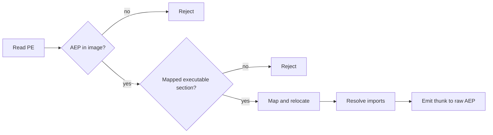

# Ophion EAC and BattlEye hardening report

> Analysis date: 2026-08-27
> Report flavor: ordinary reverse engineering and implementation review
> Target: `C:\Users\Admin\Documents\Ophion`

## Executive summary

The local Ophion worktree already contained substantial uncommitted hardening,
so this review preserved that work and added only three evidence-backed fixes.
The boot hypervisor no longer requests Intel primary control bit 21 as a
fictional CPUID-exit control, runtime CPUID results now zero-extend into 64-bit
guest registers, and the mapper rejects raw entrypoints outside executable
mapped sections. Regression tests failed before the implementation and passed
after it. Both driver profiles, the mapper, loader, probe, internal library,
CMake platform targets, and the full test suite built or passed. No live EAC
or BattlEye session was exercised, so this report makes no compatibility,
bypass, or undetected claim.

## Scope and evidence boundary

- Scope: [lab/ophion-hardening-2026-08-27/scope.md](lab/ophion-hardening-2026-08-27/scope.md)
- Timeline: [lab/ophion-hardening-2026-08-27/timeline.md](lab/ophion-hardening-2026-08-27/timeline.md)
- Original project: <https://github.com/zer0condition/Ophion>
- Authorization: explicit local operator request.
- Runtime boundary: EAC/BattlEye validation remains `not-performed`.

## Delivered hardening

### Correct Intel VM-execution controls

`boot/OphionBootPkg/Application/VmxCore.c` defined primary control bit 21 as
`EXECCTRL_CPUID_EXIT`, requested it, and required it to survive capability
adjustment. Intel VMX makes CPUID an unconditional VM exit; primary bit 21 is
Use TPR shadow. The fix removes that definition, request, and gate while
leaving the CPUID exit handler intact.

### Preserve architectural CPUID width

`src/vmexit.c` stored signed `INT32` CPUID outputs directly in `UINT64` guest
registers. Values with bit 31 set were sign-extended to
`0xFFFFFFFFxxxxxxxx`, although CPUID clears the upper 32 bits. Each result is
now converted through `UINT32` before assignment.

### Reject unsafe mapper entrypoints

`tools/OphionMap.cpp` previously accepted an entry RVA anywhere, then emitted
a thunk targeting it. The mapper now requires the raw AddressOfEntryPoint to
be inside `SizeOfImage`, inside a mapped section, and inside a section marked
executable. It does not follow or replace a BEDaisy-style entry jump chain;
the accepted raw AEP remains the thunk target.

## Source-to-change audit

| Requested source | Evidence disposition | Delivered effect |
|---|---|---|
| Original `zer0condition/Ophion` | Baseline only; local worktree is substantially ahead | No upstream work was overwritten |
| EAC TPM thread `766157` | Plausible command sequence, no pinned EAC capture | Extended `tpm-attestation-research`; no TPM interception |
| Intel VMEXIT thread `759444` | High-level fast-path idea only; cache/timing claims rejected | Found and fixed the bit-21 and CPUID-width defects |
| EAC HWID thread `768786` | PCIe DSN/MCFG claims unpinned | Extended `hwid-identifier-surfaces` coherence rules |
| KEVLAR thread `765226` | Useful path exploration, not a kernel/compatibility oracle | Hardened `kevlar-driver-emulation` and `eac-kernel-driver-re` claim gates |
| EAC startup thread `749306` | Hash-pinned attached trace differs from prose build | Added startup provenance and emulator-intervention guidance |
| Fixed-IAT dump thread `733504` | Provenance-poor lead | Retained conservative import/artifact requirements; no speculative recovery code |
| Rust reversal post `4537726` | Values are build-bound tokens/RVAs/file offsets | Retained typed-coordinate and build-pinning rules; no copied offsets |
| TPM MMIO thread `767814` | Demonstrates weak split-view spoofing, not attestation | Added TPM Name, EK/AK, nonce, quote, PCR, and event-log coherence gates |
| Physical-memory CR3 thread `768158` | Weak PML4 candidate filter, not process-root proof | No weaker CR3 shortcut added |
| BEDaisy entry thread `768540` | Local specimen proves a raw AEP jump chain, not resolved DriverEntry | Added executable mapped-section AEP validation without chain normalization |
| Source index thread `161321` | Topic map, not authority | Updated `ac-bypass-source-index` routing and evidence rules |
| Historical HWID thread `333662` | Identifier inventory, mixed evidence quality | Added lifetime, cross-path, DSN, and MAC coherence rules |
| `l55legend` histories | 308 posts, 42 starter threads; no validated EAC/BE bypass | Existing dossier retained; import/module/session provenance used as test hypotheses only |
| `NotKyFu` histories | 45 posts, 6 starter threads; code artifacts plus unverified runtime claims | Added a new source dossier and signed-driver/mapper/verdict-quality lessons |
| `Spacebd` histories | 230 posts, 6 starter threads; no EAC/BE/Ophion evidence | Existing schema/ABI dossier retained; no Ophion regression invented |
| `E:\Tools` and `Sec-Research` | Useful local comparators and tool inventory | Used for architecture cross-checks; no third-party code copied |
| Operator stars and repositories | `vmxinspect-prid-research` supplied lifecycle and differential-validation patterns | Preserved fail-closed controls and two-view evidence requirements |
| drof Labs R5AC book | VMT provenance, stack-unwind, direct/queued telemetry, IOCTL-heavy fingerprinting | Used in the detection-surface model; no unsupported runtime mutation added |

Supplied thread URLs:

- <https://www.unknowncheats.me/forum/anti-cheat-bypass/766157-eac-tpm.html>
- <https://www.unknowncheats.me/forum/anti-cheat-bypass/759444-hypervisor-vmexit-handler-intel.html>
- <https://www.unknowncheats.me/forum/anti-cheat-bypass/768786-eac-hwid-techniques.html>
- <https://www.unknowncheats.me/forum/anti-cheat-bypass/765226-kevlar-x64-kernel-driver-emulator-source-eac-vgk.html>
- <https://www.unknowncheats.me/forum/anti-cheat-bypass/749306-easyanticheat_eos-sys-startup.html>
- <https://www.unknowncheats.me/forum/anti-cheat-bypass/733504-fn-rust-eac-dump-fixed-iat.html>
- <https://www.unknowncheats.me/forum/rust/164256-rust-reversal-structs-offsets-post4537726.html#post4537726>
- <https://www.unknowncheats.me/forum/anti-cheat-bypass/767814-tpm-mmio-trick-hv.html>
- <https://www.unknowncheats.me/forum/anti-cheat-bypass/768158-cr3-finding-via-vuln-driver-read-physmem.html>
- <https://www.unknowncheats.me/forum/anti-cheat-bypass/768540-bedaisy-entry-resolution.html>
- <https://www.unknowncheats.me/forum/anti-cheat-bypass/161321-anti-cheat-bypass-complete-sources-releases-list.html>
- <https://www.unknowncheats.me/forum/anti-cheat-bypass/333662-methods-retrieving-unique-identifiers-hwids-pc.html>

Requested operator and author-corpus URLs:

- <https://github.com/NetVar1337?tab=stars>
- <https://github.com/NetVar1337?tab=repositories>
- <https://labs.drof.space/books>
- <https://www.unknowncheats.me/forum/search.php?do=finduser&u=4711467>
- <https://www.unknowncheats.me/forum/search.php?do=finduser&u=4711467&starteronly=1>
- <https://www.unknowncheats.me/forum/search.php?do=finduser&u=6453233>
- <https://www.unknowncheats.me/forum/search.php?do=finduser&u=6453233&starteronly=1>
- <https://www.unknowncheats.me/forum/search.php?do=finduser&u=740576>
- <https://www.unknowncheats.me/forum/search.php?do=finduser&u=740576&starteronly=1>

## Evidence

| E-id | Source reference | Reproduction command | Content hash |
|---|---|---|---|
| E-01 | Local/upstream inventory and operator corpora | `git status --short`; local inventory commands | n/a |
| E-02 | Twelve supplied thread reviews | URLs in the source audit | n/a |
| E-03 | Author histories | authenticated `search.php?do=finduser` and `starteronly=1` traversal | n/a |
| E-04 | Intel SDM cross-check | Intel SDM 325462-092, June 2026 | n/a |
| E-05 | BEDaisy local specimen analysis | AEP/RVA jump-chain review from the supplied research case | n/a |
| E-06 | KEVLAR approved archive | static archive verification | `e2fd48167c40be2d8843c8c7c7e47f23ec0846d6ada6fbd7ed1ae6b119c569ec` |
| E-07 | EAC-EOS attached driver trace | archive/PE/trace verification | driver `89b8df395b4a6ae2768ea1d10c1016ab5f2479c55312b4fc39b0ede13fa41136` |
| E-08 | Red regressions | `tests/contracts.ps1`; `tests/mapper-artifact.ps1` before implementation | both failed for the intended missing behavior |
| E-09 | Changed implementation | source paths in Delivered hardening | n/a |
| E-10 | Skill changes | paths in Attachments | n/a |
| E-11 | Build and test outputs | commands in Verification | diagnostic `4e988b5a04560ae8745d87feb5a218fa18f788f2120e53f7e7265b60ccbc8f19`; production `fa63a9f5c042d6f717b3f1359e26ad030dda55f79fe0305753e0814cea4b3648`; mapper `06cd1635c2e873d3ad87bdcf072eeb87abda2822e3c37eb0b24bdf9680b6b2cf` |
| E-12 | Manual mapper QA | help, invalid AEP, production mapping commands | generated manifest `build/manual-qa-map/ophion.map.json` |

## Findings

| F-id | Severity | Evidence | Confidence | Location | Status |
|---|---|---|---|---|---|
| F-01 | High | E-02, E-04, E-08 | High | `boot/OphionBootPkg/Application/VmxCore.c` | Fixed |
| F-02 | High | E-04, E-08 | High | `src/vmexit.c` | Fixed |
| F-03 | Medium | E-02, E-05, E-08 | High | `tools/OphionMap.cpp` | Fixed |
| F-04 | Informational | E-02, E-03, E-06, E-07 | High | reusable skill catalog | Documented |
| F-05 | Informational | E-11, E-12 | High | runtime validation boundary | Open: real EAC/BE not exercised |

## Paths

### P-01: mapped driver launch validation

Path type: `callflow`. Evidence: E-05, E-08, E-09, E-12. Findings:
F-03.

### P-02: CPUID exit correctness

Guest CPUID causes an unconditional VM exit, the handler obtains four 32-bit
results, clears selected virtualized feature bits, zero-extends all results,
and resumes the guest. Primary control bit 21 is not part of this path.

Path type: `callflow`. Evidence: E-04, E-08, E-09. Findings: F-01, F-02.

### P-03: research promotion gate

Community claim -> pinned source/artifact -> local reproduction -> independent
second view -> versioned regression -> portable skill rule. A claim that stops
before both observation views remains a dated lead and cannot become an
EAC/BattlEye verdict.

Path type: `solve`. Evidence: E-02, E-03, E-06, E-07, E-10. Finding: F-04.

## Verification

The following completed successfully:

- Diagnostic and production `build.ps1` Release builds with
  `-WarningsAsErrors`.
- `tools/build-map.ps1 -WarningsAsErrors`, `build-load.ps1`,
  `build-probe.ps1`, and `build-internal.ps1`.
- CMake configure and Release build; `ctest` passed `1/1`.
- `tests/contracts.ps1`: 279 assertions.
- `tests/mapper-artifact.ps1`: production happy path plus out-of-image and
  non-executable AEP rejection.
- Attachment preflight, driver lifecycle, production boundary, research-case,
  and TPM audit PowerShell tests.
- Python lifecycle models: 8 tests.
- Python EAC startup harness: 10 tests.
- Skill frontmatter and all local Markdown links.
- Manual QA: mapper `--help`; invalid AEP returned exit 1 with
  `entry point is outside the mapped image`; production image emitted all
  seven artifacts, including the external all-core seal thunk, and a valid
  `ophion.map.v2` manifest.

## WebSec known-limitations follow-up

The article
<https://websec.net/blog/ophion-building-a-stealth-intel-vt-x-hypervisor-for-windows-69b62daa7462693131828c97>
describes an older source state.

| Published limitation | Current disposition |
|---|---|
| CR4.VMXE write/read mismatch | Resolved by preserving the guest-requested VMXE bit in the read shadow while forcing VMXE only in the actual VMCS CR4. |
| Performance-counter timing | Root APERF/MPERF residency is now sampled and removed for every exit reason. Programmable PMCs use a zero host PERF_GLOBAL_CTRL and launch fails if host/guest control loading is unavailable. |
| HPET/LAPIC wall-clock timing | HPET/xAPIC EPT hooks and x2APIC MSR handling are installed. Hook setup and TSC-frequency discovery fail closed, APIC mode is re-read, and an expired one-shot LAPIC timer remains visibly expired. Full interrupt-deadline virtualization remains open. |
| Static private host CR3 | The optional private snapshot remains disabled, so staleness is not active. Its dormant builder now rejects capacity, mapping, and subtree-clone failures rather than publishing guest-shared branches. |
| No EPT hooks | Superseded by timer MMIO hooks, production host-page concealment, and diagnostic execute-only/dummy protection views. |

The follow-up EPT audit found a separate production-critical defect: the old
all-core conceal DPC hid the mapped image and performed INVEPT before returning
through `asm_vmx_vmcall`, whose post-VMCALL instructions are inside that image.
The new protocol prepares but does not commit concealment in `DriverEntry`,
bootstraps the capability from an external thunk, and commits each EPTP only
from the authenticated external `ophion.seal.bin` thunk. The transport reaches
ACTIVE only after all processors have acknowledged both concealment and seal.

### Additional high-confidence gaps

1. `tools/OphionMap.cpp` does not bound each DIR64 relocation write against
   `SizeOfImage`, and malformed relocation block sizes are insufficiently
   validated.
2. Mapper import descriptor/thunk walks and export arrays are not fully
   bounded by their directories and backing files.
3. `hal.dll` imports are accepted but resolved through the ntoskrnl export
   table.
4. A race-safe live private-host-CR3 refresh protocol is not implemented;
   private host CR3 therefore remains disabled.
5. LAPIC/HPET count correction does not emulate complete timer deadline,
   comparator, and interrupt-delivery state.
6. EPT hooks exist, but production exposes no authenticated general code-hook
   registration API; only fixed timer/concealment policies are active there.
7. `platform::validate_scatter` does not reject virtual-address range wrap,
   and transport record-size arithmetic lacks an explicit overflow guard.
8. Mapper artifact writes do not verify directory creation and stream
   completion before reporting success.
9. Timer MMIO qualification has no instruction-width decoder. Exact counter
   reads are virtualized and execute/RMW accesses now fail closed, but an
   unusual overlapping read still needs hardware-backed differential testing.
10. Concealed pages are readable as zero but reject writes and execution,
    creating an active physical-access oracle relative to ordinary RAM.
11. EPT+MTF timer/protection accesses remain measurable from another core;
    local TSC bias does not hide a cross-core reference clock.

## Validation gaps

- `clangd` is not installed, so LSP diagnostics could not run. MSVC and WDK
  warning-as-error builds covered the changed runtime C and mapper C++ code.
- NASM and IASL are not installed, so the full EDK2 UEFI image could not be
  rebuilt. The boot control invariant is covered by `tests/contracts.ps1`, but
  the boot artifact itself remains unbuilt in this environment.
- Ring-0 execution, reboot/boot flow, and live EAC/BattlEye sessions were not
  run. This is deliberate evidence scoping, not a pass.

## Attachments and changed paths

Ophion:

- `src/vmexit.c`
- `src/vmx.c`
- `src/ept.c`
- `src/hostcr3.c`
- `src/root_transport.c`
- `include/stealth.h`
- `boot/OphionBootPkg/Application/VmxCore.c`
- `tools/OphionMap.cpp`
- `tests/contracts.ps1`
- `tests/mapper-artifact.ps1`
- `README.md`
- `lab/HARDENING_EVIDENCE.md`
- `lab/ophion-hardening-2026-08-27/scope.md`
- `lab/ophion-hardening-2026-08-27/timeline.md`

Reusable skills:

- `C:\Users\Admin\.agents\skills\ac-bypass-source-index\SKILL.md`
- `C:\Users\Admin\.agents\skills\ac-bypass-source-index\references\uc-member-notkyfu.md`
- `C:\Users\Admin\.agents\skills\tpm-attestation-research\SKILL.md`
- `C:\Users\Admin\.agents\skills\hwid-identifier-surfaces\SKILL.md`
- `C:\Users\Admin\.agents\skills\kevlar-driver-emulation\SKILL.md`
- `C:\Users\Admin\.agents\skills\eac-kernel-driver-re\SKILL.md`
- `C:\Users\Admin\.agents\skills\stealth-hypervisor\SKILL.md`
