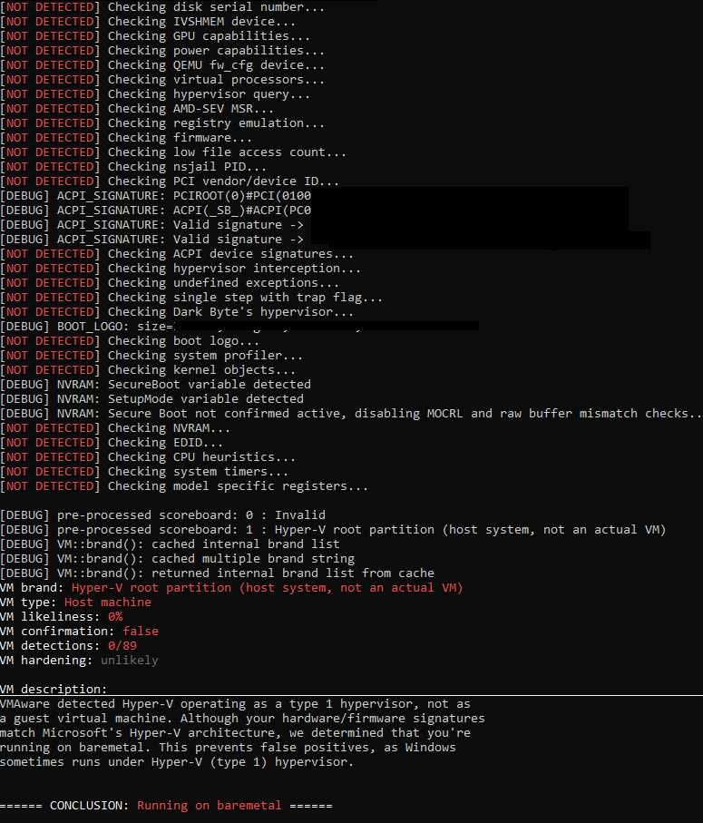

# Ophion
<div align="center">  </div>

Intel VT-x Type-2 hypervisor that virtualizes an already running Windows system. Designed for stealth: passes common hypervisor detection checks and works with **EAC/BE/AVs out of the box.** (possibly more, these are the only that have been tested)


***

## Blog

> **[Ophion — Building a Stealth Intel VT-x Hypervisor for Windows](https://websec.net/blog/ophion-building-a-stealth-intel-vt-x-hypervisor-for-windows-69b62daa7462693131828c97)**
>
> A detailed technical writeup covering the internals of Ophion — VMX bring-up, EPT construction, stealth mechanisms, and the lessons learned along the way. Thanks to [WebSec](https://websec.net) for the motivation and for hosting it.

***

## Features

- **Per-core VMX** — Virtualizes all logical processors via DPC broadcast. Clean VMXOFF on unload with guest CR3 restoration.
- **EPT with 2MB large pages** — Identity-mapped, MTRR-aware memory typing (fixed + variable ranges). Per-processor page tables with dynamic 2MB-to-4KB splitting for hooks.
- **VPID** — Capability-aware INVVPID (prefers type 3 retaining-globals, falls back gracefully).
- **Private host CR3** — Deep-copied kernel page tables isolate host mode from guest PT corruption. Built after all allocations so VMM stacks and bitmaps are mapped.
- **Private host IDT** — Isolated IDT for VMX-root mode prevents NMI hijacking (guest corrupts OS IDT, triggers NMI while in host mode). NMIs are flagged and injected to guest on next VM-exit.
- **Private host GDT** — Per-core isolated GDT for VMX-root mode. Each core has its own TSS, so the private GDT is per-VCPU. On VMXOFF, clears TSS busy bit and reloads original GDTR/TR.
- **CPUID caching** — Caches bare-metal CPUID at init. Invalid/hypervisor-range leaves return cached native values. Clears ECX[31] on leaf 1.
- **CR4.VMXE hiding** — Guest CR4 reads/writes go through shadow with VMXE stripped. CR0/CR4 writes enforce VMX fixed bits in actual VMCS.
- **TSC compensation** — "Trap next RDTSC" after CPUID VM-exit. Returns `cpuid_entry_tsc + bare_metal_cost + offset`. TSC_OFFSET never modified — zero drift.
- **MSR emulation** — Intercepts RDMSR(0x10) to apply TSC offset. Synthetic MSR range (0x40000000+) injects #GP.
- **External interrupt re-injection** — ACK-on-exit with deferred delivery via interrupt-window exiting when guest is not interruptible. TPR priority masking via shadowed CR8.
- **IDT vectoring** — Re-injects interrupted IDT events with priority. NMI deferral via NMI-window exiting on collision. Exception combining per SDM Table 6-5 (#DF generation, triple fault on #DF+exception).
- **Debug register passthrough** — Full DR0-DR7, CR8 save/restore on vmexit/vmentry. DR4/DR5 aliasing. Hardware BP matching merged into pending debug exceptions on RIP advance.
- **XSETBV validation** — SDM-compliant XCR0 validation using hardware capability mask from CPUID.0Dh.
- **MOV CR handling** — CR3 writes strip PCID bit 63, flush via INVVPID. CLTS and LMSW per SDM.
- **VMCALL gate** — Signature-verified (R10/R11/R12), CPL-checked (ring 0 only). User-mode VMCALL gets #UD.

***

## VMCS Configuration

| Field | Value |
|-------|-------|
| **Pin-based** | External-interrupt exiting, NMI exiting, virtual NMIs |
| **Primary proc** | TSC offsetting, MSR bitmaps, I/O bitmaps, activate secondary. CR3/HLT/MOV-DR/RDTSC/INVLPG exiting may be forced by must-be-1 bits. |
| **Secondary proc** | EPT, VPID, RDTSCP, INVPCID, XSAVES/XRSTORS |
| **Exit** | 64-bit host, save debug controls, ACK interrupt on exit |
| **Entry** | IA-32e mode guest, load debug controls |
| **PFEC mask/match** | Both 0 — all #PFs go to guest |
| **CR0 mask** | 0 (full pass-through) |
| **CR4 mask** | Bit 13 (VMXE) when stealth enabled, 0 otherwise |
| **MSR bitmap** | Intercept RDMSR(0x10), IA32_FEATURE_CONTROL (0x3A), VMX capability MSRs (0x480-0x493) |
| **I/O bitmaps** | All zeros |
| **EPT pointer** | WB cache, 4-level walk |
| **VPID** | Tag 1 |
| **HOST_CR3** | Private deep-copied kernel PTs (or system CR3 if disabled) |
| **HOST_IDTR** | Private IDT with controlled handlers (or system IDT if disabled) |
| **HOST_GDTR** | Per-core private GDT copy (or system GDT if disabled) |

***

## Architecture

```
include/
    hv.h                Master header, function prototypes
    hv_types.h          Per-VCPU state, EPT structures, VMCALL numbers
    ia32.h              Intel architecture defines (MSRs, VMCS fields, EPT, control bits)
    stealth.h           Anti-detection feature toggles and types
    asm_prototypes.h    C prototypes for MASM routines

src/
    driver.c            DriverEntry, IOCTL dispatch, device setup
    vmx.c               VMX lifecycle (VMXON/VMCS alloc, VMCS programming, launch)
    vmexit.c            VM-exit handler (CPUID, CR, MSR, EPT, interrupts, etc.)
    ept.c               EPT init, MTRR map, identity mapping, split/lookup
    events.c            Exception/interrupt injection (#GP, #UD, #DF, #BP, #PF, external)
    broadcast.c         Multi-processor DPC broadcast for virtualize/terminate
    hostcr3.c           Private host page table deep-copy
    hostidt.c           Private host IDT for VMX-root mode
    hostgdt.c           Per-core private host GDT for VMX-root mode
    stealth.c           CPUID cache init, bare-metal cost calibration, XCR0 validation
    globals.c           Global variable definitions
    util.c              VA/PA translation, GDT/segment helpers

asm/
    AsmVmexitHandler.asm    VM-exit entry point (save/restore GPRs + XMM + MXCSR)
    AsmVmxContext.asm       Guest state save/restore for VMLAUNCH
    AsmVmxOperation.asm     CR4.VMXE enable, VMCALL with signature
    AsmVmxIntrinsics.asm    INVEPT/INVVPID wrappers
    AsmSegmentRegs.asm      Segment register getters/setters, GDT/IDT
    AsmCommon.asm           RFLAGS, GDTR/IDTR/TR reload, CR2 write
    AsmHostIdt.asm          Private host IDT handlers (NMI, #DF, #GP)
```

***

## Building

Requires Visual Studio 2022, WDK 10.0.26100.0, and MSVC with MASM (x64).

```bash
MSBuild.exe Ophion.sln /p:Configuration=Release /p:Platform=x64
```

Output: `build\bin\Release\Ophion.sys` (test-signed).

***

## Loading

```bash
sc create Ophion type= kernel binPath= "C:\path\to\Ophion.sys"
sc start Ophion
```

Requires test signing enabled (`bcdedit /set testsigning on`).

```bash
sc stop Ophion
sc delete Ophion
```

***

## Stealth Toggles

Defined in `include/stealth.h`:

| Toggle | Default | Description |
|--------|---------|-------------|
| `STEALTH_ENABLED` | 1 | Master stealth switch |
| `STEALTH_HIDE_CR4_VMXE` | 1 | Hide CR4.VMXE from guest via CR4 shadow |
| `STEALTH_COMPENSATE_TIMING` | 1 | TSC compensation for RDTSC+CPUID+RDTSC timing attacks |
| `STEALTH_CPUID_CACHING` | 1 | Cache native CPUID responses for invalid/hypervisor leaves |
| `USE_PRIVATE_HOST_CR3` | 1 | Isolated host page tables (deep-copied kernel PTs) |
| `USE_PRIVATE_HOST_IDT` | 1 | Isolated host IDT (prevents NMI hijacking in VMX-root) |
| `USE_PRIVATE_HOST_GDT` | 1 | Per-core isolated host GDT |

***

## Tested On

- Intel Core i5-14400F (14th Generation), Windows 10 x64

***

## Detection Tests

Passes with all stealth toggles enabled:

- [hvdetecc](https://github.com/can1357/hvdetecc) — CR4.VMXE shadow, MSR 0x10 interception, CPUID timing
- [VMAware](https://github.com/kernelwernel/VMAware) — DR trap (DR0 + TF on CPUID, DR6 BS+B0), CPUID checks
- [checkhv_um](https://github.com/zer0condition/checkhv_um) — RDTSC+CPUID+RDTSC timing, CPUID leaf enumeration, brand string


***

## Disclaimer

This project has not been thoroughly tested for long-term usage or stability. It is intended primarily as a learning resource and a foundation for further development. Use at your own risk.

***

## Credits

- [HyperDbg](https://github.com/HyperDbg/HyperDbg) — Referenced for VMX architecture and VM-exit handling patterns
- [humzak711](https://github.com/humzak711) — Stealth feedback: MSR feature hiding (IA32_FEATURE_CONTROL, VMX MSRs), CPUID SMX masking
- [VMAware](https://github.com/kernelwernel/VMAware) — Hypervisor detection testing
- [hvdetecc](https://github.com/can1357/hvdetecc) — Hypervisor detection testing
- [Claude](https://claude.ai) — Debugging assistance and IA-32 architecture research

## License

MIT
